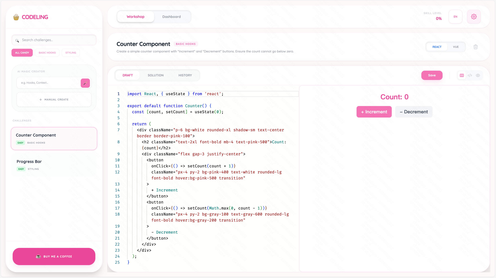

# Codeling — Frontend Hand-Coding Trainer

  

简体中文说明（zh-CN）

## 概要

Codeling 是一个面向前端学习者的手写题训练器，提供挑战列表、代码编辑器与即时预览，方便在本地练习 React / Vue 代码片段与 UI 交互。

## 主要特性

- 题库与分类浏览
- 内置代码编辑器（Monaco）和实时预览
- 支持 React / Vue 代码模板
- 本地持久化练习记录

## 技术栈

- 前端：React、TypeScript
- 构建：Vite
- 编辑器：Monaco Editor（通过 CDN 加载 loader）

## 快速开始

先决条件：已安装 Node.js（建议 v18+）和 npm

克隆仓库并安装依赖：

\`\`\`bash
git clone <your-repo-url>
cd codeling
npm install
\`\`\`

启动开发服务器：

\`\`\`bash
npm run dev
\`\`\`

开发服务器会尝试在 `3000` 端口启动，若被占用会自动切换到下一个端口（例如 `3001`）。根据终端提示在浏览器打开本地地址。

构建与预览：

\`\`\`bash
npm run build
npm run preview
\`\`\`

## 常见问题（白屏排查）

如果启动后页面空白（白屏），请按以下顺序排查：

1. 打开浏览器开发者工具（Console & Network），查看是否有错误或 404。
2. 确认 `index.html` 中存在根节点 `

`。
3. 确认页面入口由 Vite 加载：`index.html` 应包含：

\`\`\`html

\`\`\`

4. 检查终端 Vite 日志是否有构建错误。

仓库中已修复的情况：如果 `index.html` 使用 `importmap` 指向外部 CDN（如 esm.sh）直接加载 React，会绕过 Vite 的模块解析，导致依赖不一致和白屏。已将该 importmap 移除，改为由 Vite 加载入口模块。

如果仍无法解决，请将浏览器 Console 的报错贴到 issue 中或联系我，我会继续协助定位并修复。

## 目录说明

- `index.html` — 应用根 HTML
- `index.tsx` — React 入口
- `App.tsx` — 主界面组件
- `components/`、`services/` — UI 组件与服务实现

## 贡献

欢迎提交 issue 或 PR。请遵循常见的 GitHub 工作流：fork -> branch -> commit -> pull request。

## 许可证

本项目采用 MIT 许可证。